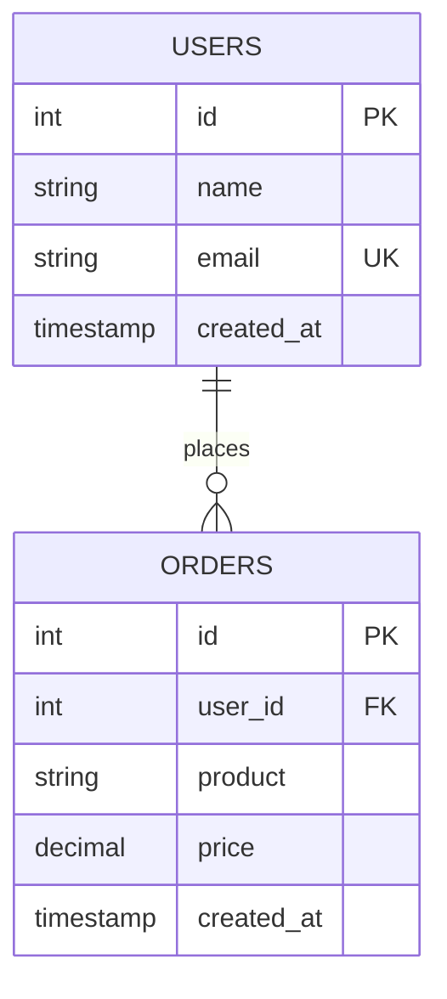

# Database Schema Documentation

## 목차
- [개요](#개요)
- [테이블 정의](#테이블-정의)
- [관계](#관계)
- [제약조건](#제약조건)
- [예시 쿼리](#예시-쿼리)
- [ERD 다이어그램](#erd-다이어그램)

---

## 개요

이 데이터베이스 스키마는 사용자 정보와 주문 기록을 관리하는 전자상거래 시스템을 위해 설계되었습니다.

**주요 특징:**
- 사용자 정보 중앙화 관리
- 주문 이력 추적
- 데이터 무결성 보장
- 확장 가능한 구조

---

## 테이블 정의

### 1. users (사용자 테이블)

사용자의 기본 정보를 저장하는 테이블입니다.

```sql
CREATE TABLE users (
    id INT PRIMARY KEY AUTO_INCREMENT,
    name VARCHAR(100),
    email VARCHAR(150) UNIQUE,
    created_at TIMESTAMP DEFAULT CURRENT_TIMESTAMP
);
```

**컬럼 설명:**

| 컬럼명 | 타입 | 설명 | 제약조건 |
|--------|------|------|---------|
| `id` | INT | 사용자 고유 식별자 | PRIMARY KEY, AUTO_INCREMENT |
| `name` | VARCHAR(100) | 사용자 이름 | - |
| `email` | VARCHAR(150) | 사용자 이메일 | UNIQUE (중복 불가) |
| `created_at` | TIMESTAMP | 계정 생성 시간 | DEFAULT CURRENT_TIMESTAMP |

---

### 2. orders (주문 테이블)

사용자의 주문 내역을 기록하는 테이블입니다.

```sql
CREATE TABLE orders (
    id INT PRIMARY KEY AUTO_INCREMENT,
    user_id INT,
    product VARCHAR(100),
    price DECIMAL(10,2),
    created_at TIMESTAMP DEFAULT CURRENT_TIMESTAMP,
    FOREIGN KEY (user_id) REFERENCES users(id)
);
```

**컬럼 설명:**

| 컬럼명 | 타입 | 설명 | 제약조건 |
|--------|------|------|---------|
| `id` | INT | 주문 고유 식별자 | PRIMARY KEY, AUTO_INCREMENT |
| `user_id` | INT | 주문한 사용자 ID | FOREIGN KEY (users.id 참조) |
| `product` | VARCHAR(100) | 상품명 | - |
| `price` | DECIMAL(10,2) | 상품 가격 | - |
| `created_at` | TIMESTAMP | 주문 생성 시간 | DEFAULT CURRENT_TIMESTAMP |

---

## 관계

### One-to-Many 관계 (1:N)

```
users (1) ──────────── (Many) orders
```

**관계 설명:**
- 한 명의 사용자(users)는 여러 개의 주문(orders)을 가질 수 있습니다.
- 각 주문은 정확히 하나의 사용자에 속합니다.
- `orders.user_id`는 `users.id`를 참조합니다.

**관계 특성:**
- **참조 무결성**: 존재하지 않는 user_id로는 주문을 생성할 수 없습니다.
- **카디널리티**: users와 orders는 1:N 관계입니다.
- **선택성**: 모든 사용자가 주문을 반드시 해야 하는 것은 아닙니다.

---

## 제약조건

### Primary Key (PK)

| 테이블 | 컬럼 | 설명 |
|--------|------|------|
| users | id | 각 사용자를 고유하게 식별 |
| orders | id | 각 주문을 고유하게 식별 |

**특징:**
- NULL 값을 가질 수 없음
- 각 테이블 내에서 고유해야 함
- 자동 증가(AUTO_INCREMENT) 설정으로 중복 방지

---

### Unique Constraint

| 테이블 | 컬럼 | 설명 |
|--------|------|------|
| users | email | 이메일 중복 가입 방지 |

**특징:**
- 같은 이메일로 여러 계정 생성 불가
- 데이터 유효성 보증

---

### Foreign Key (FK)

| 테이블 | 컬럼 | 참조 대상 | 설명 |
|--------|------|---------|------|
| orders | user_id | users.id | 주문과 사용자 연결 |

**특징:**
- 참조 무결성 보장
- orders 테이블에 존재하지 않는 user_id 삽입 불가
- users 테이블의 id 변경/삭제 시 관련 제약 발생

---

### Default Value

| 테이블 | 컬럼 | 기본값 | 설명 |
|--------|------|--------|------|
| users | created_at | CURRENT_TIMESTAMP | 레코드 생성 시 현재 시간 자동 입력 |
| orders | created_at | CURRENT_TIMESTAMP | 레코드 생성 시 현재 시간 자동 입력 |

---

## 예시 쿼리

### INSERT 쿼리

#### 1. 사용자 추가

```sql
-- 단일 사용자 추가
INSERT INTO users (name, email)
VALUES ('John Doe', 'john@example.com');

-- 여러 사용자 추가
INSERT INTO users (name, email) VALUES
('Alice Smith', 'alice@example.com'),
('Bob Johnson', 'bob@example.com'),
('Carol White', 'carol@example.com');
```

#### 2. 주문 추가

```sql
-- 단일 주문 추가
INSERT INTO orders (user_id, product, price)
VALUES (1, 'Laptop', 1299.99);

-- 여러 주문 추가
INSERT INTO orders (user_id, product, price) VALUES
(1, 'Mouse', 29.99),
(2, 'Keyboard', 79.99),
(3, 'Monitor', 299.99),
(1, 'USB Cable', 9.99);
```

---

### SELECT 쿼리

#### 1. 기본 조회

```sql
-- 모든 사용자 조회
SELECT * FROM users;

-- 모든 주문 조회
SELECT * FROM orders;

-- 특정 사용자의 주문 조회
SELECT * FROM orders WHERE user_id = 1;
```

#### 2. JOIN 쿼리

```sql
-- 모든 사용자와 그들의 주문 조회 (LEFT JOIN)
SELECT 
    u.id,
    u.name,
    u.email,
    o.id AS order_id,
    o.product,
    o.price,
    o.created_at AS order_date
FROM users u
LEFT JOIN orders o ON u.id = o.user_id
ORDER BY u.id, o.created_at DESC;
```

**출력 예시:**
```
| id | name        | email              | order_id | product       | price   | order_date          |
|----|-------------|--------------------|----------|---------------|---------|---------------------|
| 1  | John Doe    | john@example.com   | 1        | Laptop        | 1299.99 | 2025-12-04 10:30:00 |
| 1  | John Doe    | john@example.com   | 4        | Mouse         | 29.99   | 2025-12-04 10:31:00 |
| 1  | John Doe    | john@example.com   | 5        | USB Cable     | 9.99    | 2025-12-04 10:32:00 |
| 2  | Alice Smith | alice@example.com  | 2        | Keyboard      | 79.99   | 2025-12-04 10:31:00 |
| 3  | Bob Johnson | bob@example.com    | 3        | Monitor       | 299.99  | 2025-12-04 10:32:00 |
```

---

#### 3. 집계 쿼리

```sql
-- 사용자별 주문 횟수
SELECT 
    u.name,
    u.email,
    COUNT(o.id) AS order_count
FROM users u
LEFT JOIN orders o ON u.id = o.user_id
GROUP BY u.id, u.name, u.email
ORDER BY order_count DESC;
```

```sql
-- 사용자별 총 구매액
SELECT 
    u.name,
    u.email,
    SUM(o.price) AS total_spent,
    AVG(o.price) AS average_price,
    COUNT(o.id) AS order_count
FROM users u
LEFT JOIN orders o ON u.id = o.user_id
GROUP BY u.id, u.name, u.email
ORDER BY total_spent DESC;
```

```sql
-- 특정 가격 이상의 주문 조회
SELECT 
    u.name,
    o.product,
    o.price
FROM users u
INNER JOIN orders o ON u.id = o.user_id
WHERE o.price >= 100
ORDER BY o.price DESC;
```

---

#### 4. 기본 정보 조회

```sql
-- 주문한 사용자 정보 (주문이 있는 사용자만)
SELECT DISTINCT
    u.id,
    u.name,
    u.email,
    u.created_at
FROM users u
INNER JOIN orders o ON u.id = o.user_id
ORDER BY u.created_at DESC;
```

```sql
-- 최근 주문 조회 (최근 7일)
SELECT 
    u.name,
    o.product,
    o.price,
    o.created_at
FROM users u
JOIN orders o ON u.id = o.user_id
WHERE o.created_at >= DATE_SUB(NOW(), INTERVAL 7 DAY)
ORDER BY o.created_at DESC;
```

---

## ERD 다이어그램

### Mermaid 버전



### 텍스트 버전 (ASCII)

#### 상세 ERD

```
┌─────────────────────────────────┐
│           users                 │
├─────────────────────────────────┤
│ PK │ id          INT             │
│    │ name        VARCHAR(100)    │
│ U  │ email       VARCHAR(150)    │
│    │ created_at  TIMESTAMP       │
└─────────────────────────────────┘
           │
           │ (1 : N)
           │
           ↓
┌─────────────────────────────────┐
│          orders                 │
├─────────────────────────────────┤
│ PK │ id          INT             │
│ FK │ user_id     INT ────┐       │
│    │ product     VARCHAR │       │
│    │ price       DECIMAL │       │
│    │ created_at  TIMESTAMP       │
└─────────────────────────────────┘
```

#### 간단한 다이어그램

```
         users
           │
           │ (1 user : N orders)
           │
           ├─── id (PK)
           ├─── name
           ├─── email (UNIQUE)
           └─── created_at
           
              ↓ FOREIGN KEY
           
         orders
           │
           ├─── id (PK)
           ├─── user_id (FK)
           ├─── product
           ├─── price
           └─── created_at
```

#### 자세한 관계도

```
╔═══════════════════════════════════════════════════════════════╗
║                      DATABASE SCHEMA                          ║
╚═══════════════════════════════════════════════════════════════╝

┏━━━━━━━━━━━━━━━━━━━━━━━━━━━━━━┓       ┏━━━━━━━━━━━━━━━━━━━━━━━━━━━━┓
┃           USERS              ┃       ┃         ORDERS             ┃
┣━━━━━━━━━━━━━━━━━━━━━━━━━━━━━━┫       ┣━━━━━━━━━━━━━━━━━━━━━━━━━━━━┫
┃ [PK] id: INT                 ┃◄──────┃ [FK] user_id: INT          ┃
┃ name: VARCHAR(100)           ┃ 1   ∞ ┃ [PK] id: INT               ┃
┃ [U] email: VARCHAR(150)      ┃       ┃ product: VARCHAR(100)      ┃
┃ created_at: TIMESTAMP        ┃       ┃ price: DECIMAL(10,2)       ┃
┃ (DEFAULT: CURRENT_TIMESTAMP) ┃       ┃ created_at: TIMESTAMP      ┃
┗━━━━━━━━━━━━━━━━━━━━━━━━━━━━━━┛       ┃ (DEFAULT: CURRENT_TIMESTAMP)
                                        ┗━━━━━━━━━━━━━━━━━━━━━━━━━━━━┛

Legend:
[PK]  = Primary Key
[FK]  = Foreign Key
[U]   = Unique Constraint
1     = One (users)
∞     = Many (orders)
```

---

## 활용 시나리오

### 시나리오 1: 새로운 사용자 생성 및 주문 입력

```sql
-- 1. 사용자 생성
INSERT INTO users (name, email) VALUES ('Emma Davis', 'emma@example.com');

-- 2. 생성된 사용자의 ID 확인 (일반적으로 AUTO_INCREMENT로 자동 할당)
-- 위 쿼리 후 사용자 ID = 4라고 가정

-- 3. 해당 사용자의 주문 생성
INSERT INTO orders (user_id, product, price) 
VALUES (4, 'Wireless Headphones', 149.99);
```

---

### 시나리오 2: 특정 사용자의 모든 주문과 통계 조회

```sql
-- Emma Davis의 모든 주문 조회
SELECT 
    u.name,
    u.email,
    o.id AS order_id,
    o.product,
    o.price,
    o.created_at
FROM users u
JOIN orders o ON u.id = o.user_id
WHERE u.email = 'emma@example.com'
ORDER BY o.created_at DESC;

-- Emma Davis의 주문 통계
SELECT 
    u.name,
    COUNT(o.id) AS total_orders,
    SUM(o.price) AS total_spent,
    AVG(o.price) AS average_price,
    MAX(o.price) AS max_price,
    MIN(o.price) AS min_price
FROM users u
LEFT JOIN orders o ON u.id = o.user_id
WHERE u.email = 'emma@example.com'
GROUP BY u.id;
```

---

## 주의사항 및 고려사항

### ⚠️ 제약사항

1. **이메일 중복 방지**
   - 같은 이메일로 여러 계정 가입 불가

2. **Foreign Key 제약**
   - 존재하지 않는 user_id로 주문 생성 불가
   - users 테이블에서 사용자 삭제 시 관련 주문 처리 필요

3. **데이터 무결성**
   - 타임스탬프는 자동으로 생성되므로 수동 입력 불필요

### 💡 개선 제안

```sql
-- 권장: 주문 상태 추적 컬럼 추가
ALTER TABLE orders ADD COLUMN status ENUM('pending', 'completed', 'cancelled') 
DEFAULT 'pending';

-- 권장: 인덱스 추가로 조회 성능 개선
CREATE INDEX idx_user_id ON orders(user_id);
CREATE INDEX idx_created_at ON orders(created_at);

-- 권장: 최종 수정 시간 추적
ALTER TABLE orders ADD COLUMN updated_at TIMESTAMP 
DEFAULT CURRENT_TIMESTAMP ON UPDATE CURRENT_TIMESTAMP;
```

---

## 마지막 업데이트

- **생성일**: 2025년 12월 4일
- **버전**: 1.0
- **상태**: 활성

